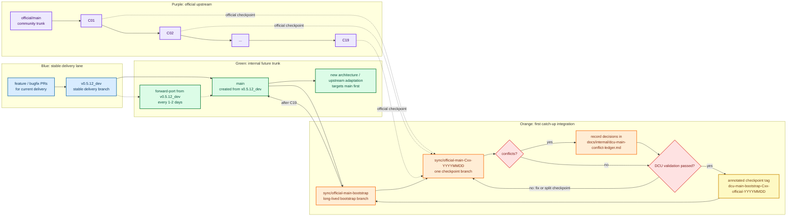
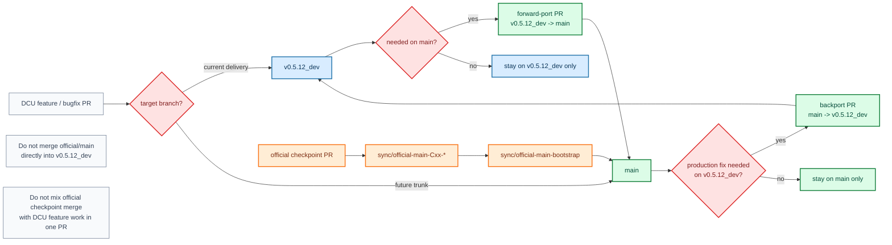
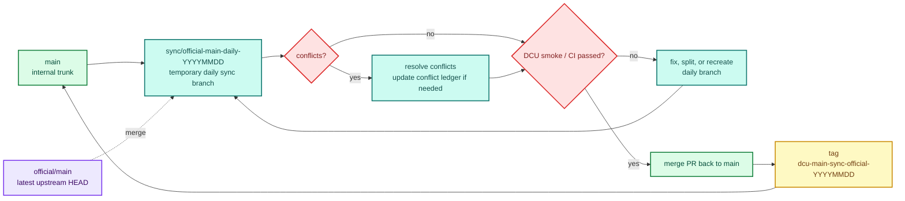

# dcu-sglang Main Branch Migration Plan

Analysis date: 2026-06-22 UTC

This document is the operating plan for creating an internal `main` branch from
`v0.5.12_dev` and incrementally merging the upstream SGLang community `main`
branch into it.

## 1. Current Snapshot

| Repository | Branch | HEAD | Subject |
|---|---|---|---|
| `/home/officials/sglang` | `main` | `62b3c8e17781` | `[Intel GPU] Guard tvm_ffi import in dsv4 online mtp module under TYPE_CHECKING to fix import error on XPU (#28531)` |
| `/home/proj_dpsk-v4/dcu-sglang` | `v0.5.12_dev` | `d4c6831a107a` | `[BugFix] workaround fix of aiter custom allreduce in cuda-graph, would revert it after driver fix it` |

Key facts:

- The merge base between the two branches is `3117415c9bcd`, dated 2026-05-15.
- `dcu-sglang` has about 205 commits and 501 changed files after the merge base.
- Official `main` has about 1641 commits and 3328 changed files after the merge base.
- About 309 files are touched by both sides, so the first bootstrap will have real conflict pressure.
- The chosen strategy is to create internal `main` from `v0.5.12_dev`, then merge official `main` by checkpoints.

## 2. Branch Strategy

Target branches:

- `v0.5.12_dev`: stable delivery branch. It continues to receive current business fixes.
- `main`: future internal trunk, initially created from `v0.5.12_dev`.
- `sync/official-main-bootstrap`: long-lived bootstrap integration branch.
- `sync/official-main-Cxx-*`: short-lived branch for each official checkpoint.
- `sync/official-main-daily-YYYYMMDD`: daily sync branch after bootstrap catches up.

Rules:

- Do not freeze `v0.5.12_dev` during bootstrap.
- Do not merge official checkpoints directly into `v0.5.12_dev`.
- Forward-port new `v0.5.12_dev` changes into `main` every one or two days.
- Keep official checkpoint merge PRs separate from DCU feature or bugfix PRs.
- Do not rewrite public branch history and do not force-push `v0.5.12_dev` or `main`.
- Enable `git rerere` in the migration workspace to reuse repeated conflict resolutions.

## 3. Official Checkpoint Merge List

| ID | Cutoff UTC | Official checkpoint | Delta commits | Risk | Notes |
|---|---:|---|---:|---|---|
| C00 | 2026-05-15 | `3117415c9bcd` | 0 | base | Common merge base |
| C01 | 2026-05-17 | `c67b2870569a` | 77 | high | Heavy test and CI overlap |
| C02 | 2026-05-19 | `425dffbde339` | 140 | medium | DeepSeek V4 MTP and attention |
| C03 | 2026-05-21 | `7cf193fe1faf` | 104 | high | Cache, model, attention |
| C04 | 2026-05-23 | `af8f66940e9b` | 66 | medium | AMD DSV4 runtime and jit-kernel |
| C05 | 2026-05-25 | `8805f4cf1666` | 50 | low | PD and scheduler |
| C06 | 2026-05-27 | `0abe6a85a51f` | 74 | medium | Model and mem_cache |
| C07 | 2026-05-29 | `a5e6a8887a94` | 113 | high | Attention and test |
| C08 | 2026-05-31 | `373cadc92ea4` | 57 | low | Mooncake and CI |
| C09 | 2026-06-02 | `c55548ba115c` | 103 | medium | Embedding, mem_cache, attention |
| C10 | 2026-06-04 | `47377525cb32` | 115 | high | CI, mem_cache, attention |
| C11 | 2026-06-06 | `5160f7914ebf` | 81 | medium | MLA EAGLE and CUDA graph |
| C12 | 2026-06-08 | `3fe6bc390bdc` | 76 | medium | Spec naming cleanup |
| C13 | 2026-06-10 | `125ef888921b` | 105 | high | Model, MoE, jit-kernel |
| C14 | 2026-06-12 | `fda795589097` | 109 | medium | AMD DFlash and fused KV |
| C15 | 2026-06-14 | `000fc975c7b3` | 70 | medium | Docker and mem_cache |
| C16 | 2026-06-16 | `2ad00faae1f4` | 92 | low | Nightly tests |
| C17 | 2026-06-18 | `62ab09a47886` | 107 | high | AMD spec tests and models |
| C18 | 2026-06-20 | `f42ec350b431` | 64 | low | MTP rejection sampling |
| C19 | 2026-06-22 | `62b3c8e17781` | 38 | low | XPU import guard |

Execution rules:

- Merge checkpoints in order from C01 to C19.
- If a checkpoint produces more than 50 conflicted files, split it by date or
  first-parent subranges before resolving.
- Tag only after the checkpoint has been merged and the required validation has passed.
- After C19 is merged, switch to daily sync from official `main`.

## 4. Tags and Milestones

Checkpoint tag names:

```text
dcu-main-bootstrap-C01-official-20260517
dcu-main-bootstrap-C02-official-20260519
...
dcu-main-bootstrap-C19-official-20260622
dcu-main-sync-official-YYYYMMDD
```

Annotated tag message template:

```text
Official checkpoint: <official sha>
DCU base branch: v0.5.12_dev
DCU main sha: <internal main sha>
Validation: <passed / failed / waived>
Known issues:
- ...
```

Milestone tags:

- `dcu-main-milestone-ci-ready`
- `dcu-main-milestone-dense-ready`
- `dcu-main-milestone-moe-nightly-ready`
- `dcu-main-milestone-daily-sync-ready`

## 5. Conflict Board

The live conflict board is kept in:

```text
docs/internal/dcu-main-conflict-ledger.md
```

Every conflict entry should record:

- Checkpoint and merge branch.
- Conflict file.
- Area owner.
- Strategy: `ours`, `theirs`, `manual merge`, `drop DCU patch`, or `port to new API`.
- Reason for the decision.
- Risk level.
- Validation performed.
- Follow-up and status.

## 6. Workflow

### 6.1 Branch Roles and Bootstrap Flow



### 6.2 Parallel Development Flow



### 6.3 Daily Sync Flow After Bootstrap



## 7. Phase Plan

### Phase 0: Preparation

Tasks:

- Create `main` and `sync/official-main-bootstrap`.
- Enable `git rerere`.
- Add the migration plan, conflict ledger, and status helper script.
- Confirm CI entry points, DCU runner labels, model paths, container images, and wheel install flow.
- Define the forward-port rule from `v0.5.12_dev` to `main`.

Validation:

- Confirm `git merge-base main official/main` is still `3117415c9bcd`.
- Run static CI registration checks.
- Do not run heavyweight model tests in this phase.

### Phase 1: CI, Test, and Basic Infrastructure

Checkpoints: C01-C04.

Tasks:

- Merge official test registry, run suite, and workflow layout changes.
- Preserve DCU runner, image, wheel, stage-a/stage-b, and nightly-dcu logic.
- Resolve heavy overlap in `test/registered/**` and `.github/workflows/**`.

Validation:

- DCU CI dry run.
- DCU test registration check.
- Stage-a smoke.

### Phase 2: Dense, VLM, and Kernel Baseline

Checkpoints: C05-C10.

Tasks:

- Merge attention, mem_cache, model_executor, and sgl-kernel changes.
- Keep Qwen2.5 dense, Qwen2.5-VL, embedding, reranker paths working.
- Align DCU/HIP kernel glue with official sgl-kernel interfaces.

Validation:

- DCU stage-b small model smoke.
- Qwen2.5 0.5B, 1.5B, and 7B server smoke.
- Qwen2.5-VL smoke.
- Embedding and reranker smoke.
- sgl-kernel DCU smoke whitelist.

### Phase 3: MoE, DeepEP, and DeepSeek V4

Checkpoints: C11-C17.

Tasks:

- Resolve `deepep.py`, MoE runner, EP/CP, DeepSeek V4, MTP, EAGLE, AITER, and DeepGEMM conflicts.
- Prefer official structure and keep DCU changes behind backend, platform, or environment guards.
- Mark temporary workaround patches with expiry conditions.

Validation:

- Qwen3 MoE smoke.
- DeepEP small and large cases.
- DeepSeek V4 startup and short request smoke.
- Small-sample accuracy checks.
- Nightly-dcu stability.

### Phase 4: Catch-up and Daily Sync

Checkpoints: C18-C19 and then daily official `main`.

Tasks:

- Merge `sync/official-main-bootstrap` into `main`.
- Start `sync/official-main-daily-YYYYMMDD`.
- Track official SHA, internal main SHA, commit lag, and last successful sync time.
- Make new development main-first, except production-only fixes for `v0.5.12_dev`.

Validation:

- Daily sync PR runs DCU smoke.
- Full nightly at least once per week.
- Official lag stays below 24 hours.
- Open a blocker issue if lag exceeds 48 hours.

## 8. Parallel Development Rules

- Current delivery and emergency fixes continue on `v0.5.12_dev`.
- New architecture, new models, and upstream adaptation work should target `main`.
- PR labels should include one of:
  - `target: v0.5.12_dev`
  - `target: main`
  - `needs-forward-port`
  - `needs-backport`
  - `dcu-main-only`
- Forward-port from `v0.5.12_dev` to `main` every one or two days.
- Do not mix official checkpoint merges and DCU feature work in one PR.
- High-risk changes in attention, MoE, DeepEP, or sgl-kernel require main migration owner review.

## 9. Completion Criteria

Migration is complete when:

- Internal `main` reaches official `62b3c8e17781` or a newer official checkpoint.
- Internal `main` lags official `main` by less than 24 hours.
- DCU regular model smoke is stable.
- MoE, DeepEP, and DeepSeek V4 are at least covered in nightly with known issue tracking.
- No unowned high-risk conflict remains in the conflict ledger.
- Milestone tags exist for C01-C19.
- New development has switched to main-first, with `v0.5.12_dev` in maintenance mode.

## 10. Local Helper

Use the helper script to inspect migration state:

```bash
python3 scripts/code_sync/dcu_main_migration.py status
python3 scripts/code_sync/dcu_main_migration.py checkpoints
python3 scripts/code_sync/dcu_main_migration.py next
python3 scripts/code_sync/dcu_main_migration.py tag-message C01 --validation passed
```
