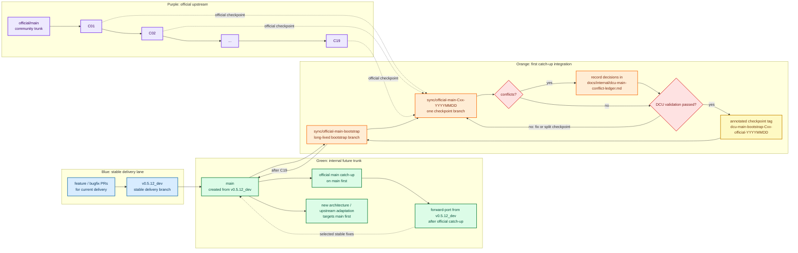
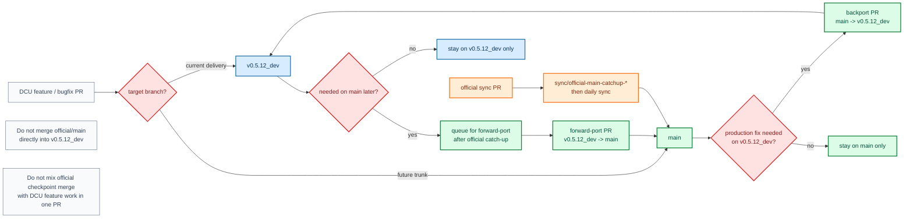
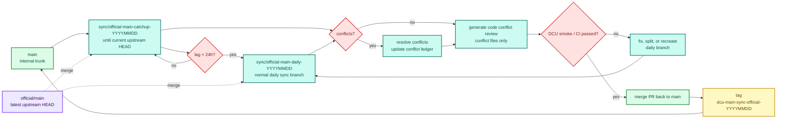

# dcu-sglang Main Branch Migration Plan

Analysis date: 2026-06-22 UTC

This document is the operating plan for creating an internal `main` branch from
`v0.5.12_dev`, landing the C01-C19 official bootstrap, then continuing official
`main` catch-up on internal `main` before broad stable-branch forward-ports.

## 1. Current Snapshot

| Repository | Branch | HEAD | Subject |
|---|---|---|---|
| `/home/officials/sglang` | `main` | `62b3c8e17781` | `[Intel GPU] Guard tvm_ffi import in dsv4 online mtp module under TYPE_CHECKING to fix import error on XPU (#28531)` |
| `/home/proj_dpsk-v4/dcu-sglang` | `v0.5.12_dev` | `d4c6831a107a` | `[BugFix] workaround fix of aiter custom allreduce in cuda-graph, would revert it after driver fix it` |

Key facts:

- The merge base between the two branches is `3117415c9bcd`, dated 2026-05-15.
- `dcu-sglang` has about 205 commits and 501 changed files after the merge base.
- Official `main` has about 1641 commits and 3328 changed files after the merge base.
- About 309 files are touched by both sides, so the first bootstrap will have real conflict pressure.
- The chosen strategy is to create internal `main` from `v0.5.12_dev`, then merge official `main` by checkpoints.


### 1.1 Post-Bootstrap Workflow Update (2026-07-09 CST)

C01-C19 bootstrap is complete and is being landed into internal `main`. Because
`v0.5.12_dev` has continued to move quickly, the post-bootstrap order is now:

1. Merge `sync/official-main-bootstrap` into `main` and tag the landing point.
2. Continue syncing newer official SGLang `main` commits on top of internal
   `main` using `sync/official-main-catchup-YYYYMMDD` branches until internal
   `main` reaches the current official upstream head.
3. Once the lag is under the daily-sync threshold, switch to the normal
   `sync/official-main-daily-YYYYMMDD` workflow.
4. Only after official catch-up is stable, progressively forward-port still
   relevant `v0.5.12_dev` changes into `main` in separate, reviewable commits or
   PRs.
5. Retire `v0.5.12_dev` once its required changes are forward-ported and the
   project is ready to maintain only `main`.

This replaces the earlier every-one-or-two-days forward-port cadence during the
bootstrap period. Emergency production fixes may still land on `v0.5.12_dev`,
but broad forward-porting is intentionally delayed until official `main` catch-up
is complete.

## 2. Branch Strategy

Target branches:

- `v0.5.12_dev`: stable delivery branch. It continues to receive current business fixes.
- `main`: internal trunk after the C01-C19 bootstrap lands. Official catch-up and future architecture work target this branch first.
- `sync/official-main-bootstrap`: completed C01-C19 bootstrap integration branch; keep it as historical evidence.
- `sync/official-main-Cxx-*`: historical short-lived branch for each bootstrap checkpoint or checkpoint group.
- `sync/official-main-catchup-YYYYMMDD`: temporary branch for post-bootstrap official `main` catch-up until internal `main` reaches the current upstream head.
- `sync/official-main-daily-YYYYMMDD`: normal daily sync branch after catch-up is current.

Rules:

- Do not freeze `v0.5.12_dev` during bootstrap.
- Do not merge official checkpoints directly into `v0.5.12_dev`.
- Delay broad `v0.5.12_dev` forward-porting until internal `main` catches up to current official `main` and the daily-sync lane is active.
- Keep official catch-up/daily-sync work separate from DCU feature or bugfix PRs.
- Do not rewrite public branch history and do not force-push `v0.5.12_dev` or `main`.
- Enable `git rerere` in the migration workspace to reuse repeated conflict resolutions.

## 3. Official Checkpoint Merge List

| ID | Cutoff UTC | Official checkpoint | Delta commits | Risk | Notes |
|---|---:|---|---:|---|---|
| C00 | 2026-05-15 | `3117415c9bcd` | 0 | base | Common merge base |
| C01 | 2026-05-17 | `c67b2870569a` | 77 | high | Heavy test and CI overlap |
| C02 | 2026-05-19 | `425dffbde339` | 140 | medium | DeepSeek V4 MTP and attention |
| C03 | 2026-05-21 | `7cf193fe1faf` | 104 | high | Cache, model, attention |
| C04 | 2026-05-23 | `af8f66940e9b` | 66 | medium | AMD DSV4 runtime and jit-kernel |
| C05 | 2026-05-25 | `8805f4cf1666` | 50 | low | PD and scheduler |
| C06 | 2026-05-27 | `0abe6a85a51f` | 74 | medium | Model and mem_cache |
| C07 | 2026-05-29 | `a5e6a8887a94` | 113 | high | Attention and test |
| C08 | 2026-05-31 | `373cadc92ea4` | 57 | low | Mooncake and CI |
| C09 | 2026-06-02 | `c55548ba115c` | 103 | medium | Embedding, mem_cache, attention |
| C10 | 2026-06-04 | `47377525cb32` | 115 | high | CI, mem_cache, attention |
| C11 | 2026-06-06 | `5160f7914ebf` | 81 | medium | MLA EAGLE and CUDA graph |
| C12 | 2026-06-08 | `3fe6bc390bdc` | 76 | medium | Spec naming cleanup |
| C13 | 2026-06-10 | `125ef888921b` | 105 | high | Model, MoE, jit-kernel |
| C14 | 2026-06-12 | `fda795589097` | 109 | medium | AMD DFlash and fused KV |
| C15 | 2026-06-14 | `000fc975c7b3` | 70 | medium | Docker and mem_cache |
| C16 | 2026-06-16 | `2ad00faae1f4` | 92 | low | Nightly tests |
| C17 | 2026-06-18 | `62ab09a47886` | 107 | high | AMD spec tests and models |
| C18 | 2026-06-20 | `f42ec350b431` | 64 | low | MTP rejection sampling |
| C19 | 2026-06-22 | `62b3c8e17781` | 38 | low | XPU import guard |

Execution rules:

- Merge checkpoints in order from C01 to C19.
- After C10, the default bootstrap step may group two or three adjacent
  checkpoints into one integration branch, for example C11-C13. The branch,
  ledger and annotated tag must record every included checkpoint SHA.
- If a checkpoint produces more than 50 conflicted files, split it by date or
  first-parent subranges before resolving.
- Split a grouped step when it produces more than 50 conflicted files, when the
  official API transitions cannot be reviewed as one unit, or when model
  startup failure cannot be isolated within the group.
- Tag only after the checkpoint has been merged and the required validation has passed.
- During larger-step bootstrap, required validation means static gates plus a
  DCU model startup and one successful short inference request. Accuracy,
  throughput and graph-performance regressions are documented and tracked but
  do not block the checkpoint unless they also prevent normal inference.
- After C19 is merged, land `sync/official-main-bootstrap` into `main`, then continue official catch-up on `main` until the latest upstream head is reached. Switch to daily sync only after catch-up is current.

## 4. Tags and Milestones

Checkpoint tag names:

```text
dcu-main-bootstrap-C01-official-20260517
dcu-main-bootstrap-C02-official-20260519
...
dcu-main-bootstrap-C19-official-20260622
dcu-main-bootstrap-C01-C19-main-YYYYMMDD
dcu-main-sync-official-YYYYMMDD
```

Annotated tag message template:

```text
Official checkpoint: <official sha>
DCU base branch: v0.5.12_dev
DCU main sha: <internal main sha>
Validation: <passed / failed / waived>
Known issues:
- ...
```

Milestone tags:

- `dcu-main-milestone-ci-ready`
- `dcu-main-milestone-dense-ready`
- `dcu-main-milestone-moe-nightly-ready`
- `dcu-main-milestone-daily-sync-ready`

## 5. Conflict Board and Code Review Artifact

The live conflict board is kept in:

```text
docs/internal/dcu-main-conflict-ledger.md
```

Every conflict entry should record:

- Checkpoint and merge branch.
- Conflict file.
- Area owner.
- Strategy: `ours`, `theirs`, `manual merge`, `drop DCU patch`, or `port to new API`.
- Reason for the decision.
- Risk level.
- Validation performed.
- Follow-up and status.

In addition to the ledger, every completed catch-up branch must generate:

```text
docs/internal/dcu-main-catchup-YYYYMMDD-conflict-review.md
```

This is a mandatory code-review artifact, not a replacement for the ledger. It
must be committed on the catch-up branch before handoff or merge to `main`, even
when runtime validation is pending or failed. It contains only files that
actually produced textual conflicts; automatically merged files and later
runtime-only fixes are excluded.

The document follows the existing `20260629` and `20260703` format: record the
exact DCU parent, common official base, official endpoint, and resolved merge
SHAs; give the conflict-file and reconstructed-hunk counts; then use one
collapsible section per file with a concise resolution intent and a Markdown
`diff` block comparing the reconstructed three-way auto-conflict text with the
committed resolution. This preserves VS Code Markdown Preview's red/green code
review experience. A catch-up with no textual conflicts still produces the
document, records zero conflicts, and omits code sections.

## 6. Workflow

### 6.1 Branch Roles and Bootstrap Flow



### 6.2 Parallel Development Flow



### 6.3 Official Catch-up and Daily Sync Flow After Bootstrap



## 7. Phase Plan

### Phase 0: Preparation

Tasks:

- Create `main` and `sync/official-main-bootstrap`.
- Enable `git rerere`.
- Add the migration plan, conflict ledger, and status helper script.
- Confirm CI entry points, DCU runner labels, model paths, container images, and wheel install flow.
- Define the forward-port rule from `v0.5.12_dev` to `main`.

Validation:

- Confirm `git merge-base main official/main` is still `3117415c9bcd`.
- Run static CI registration checks.
- Do not run heavyweight model tests in this phase.

### Phase 1: CI, Test, and Basic Infrastructure

Checkpoints: C01-C04.

Tasks:

- Merge official test registry, run suite, and workflow layout changes.
- Preserve DCU runner, image, wheel, stage-a/stage-b, and nightly-dcu logic.
- Resolve heavy overlap in `test/registered/**` and `.github/workflows/**`.

Validation:

- DCU CI dry run.
- DCU test registration check.
- Stage-a smoke.

### Phase 2: Dense, VLM, and Kernel Baseline

Checkpoints: C05-C10.

Tasks:

- Merge attention, mem_cache, model_executor, and sgl-kernel changes.
- Keep Qwen2.5 dense, Qwen2.5-VL, embedding, reranker paths working.
- Align DCU/HIP kernel glue with official sgl-kernel interfaces.

Validation:

- DCU stage-b small model smoke.
- Qwen2.5 0.5B, 1.5B, and 7B server smoke.
- Qwen2.5-VL smoke.
- Embedding and reranker smoke.
- sgl-kernel DCU smoke whitelist.

### Phase 3: MoE, DeepEP, and DeepSeek V4

Checkpoints: C11-C17.

Tasks:

- Resolve `deepep.py`, MoE runner, EP/CP, DeepSeek V4, MTP, EAGLE, AITER, and DeepGEMM conflicts.
- Prefer official structure and keep DCU changes behind backend, platform, or environment guards.
- Mark temporary workaround patches with expiry conditions.

Validation:

- Blocking: static/import gates, DCU registration, DeepSeek V4 startup, and one
  successful short inference request.
- Blocking when the corresponding path is changed and assets are available:
  one Qwen3 MoE or dense-model startup/request smoke.
- Non-blocking observations: DeepEP small/large, MTP/EAGLE, graph replay,
  small-sample accuracy, throughput and nightly-dcu stability.

### Phase 4: Bootstrap Landing, Official Catch-up, and Daily Sync

Checkpoints: C18-C19, post-C19 official catch-up, then daily official `main`.

Tasks:

- Merge `sync/official-main-bootstrap` into `main` and tag the landing point as `dcu-main-bootstrap-C01-C19-main-YYYYMMDD`.
- Continue official `main` catch-up directly on internal `main` using `sync/official-main-catchup-YYYYMMDD` branches until internal `main` reaches the latest official head.
- Track official SHA, internal main SHA, commit lag, and last successful sync time for every catch-up or daily branch.
- Switch to `sync/official-main-daily-YYYYMMDD` only after the catch-up branch brings lag under the daily threshold.
- Delay broad `v0.5.12_dev` forward-port work until official catch-up is stable; production-only fixes may continue on `v0.5.12_dev` meanwhile.

Validation:

- Daily sync PR runs DCU smoke.
- Full nightly at least once per week.
- Official lag stays below 24 hours.
- Open a blocker issue if lag exceeds 48 hours.

## 8. Parallel Development Rules

- Current delivery and emergency fixes may continue on `v0.5.12_dev` until retirement.
- New architecture, new models, upstream adaptation, and official sync work target `main`.
- PR labels should include one of:
  - `target: v0.5.12_dev`
  - `target: main`
  - `needs-forward-port`
  - `needs-backport`
  - `dcu-main-only`
- Do not run broad `v0.5.12_dev` forward-port batches until internal `main` has caught up to current official `main` and entered daily sync.
- After daily sync is active, forward-port still-relevant `v0.5.12_dev` commits in small, reviewable batches until `v0.5.12_dev` can be retired.
- Do not mix official catch-up/daily-sync merges and DCU feature work in one PR.
- High-risk changes in attention, MoE, DeepEP, or sgl-kernel require main migration owner review.

## 9. Completion Criteria

Migration is complete when:

- Internal `main` contains the C01-C19 bootstrap and is tagged at the bootstrap landing point.
- Internal `main` catches up to the current official upstream head and then lags official `main` by less than 24 hours under daily sync.
- DCU regular model smoke is stable.
- MoE, DeepEP, and DeepSeek V4 are at least covered in nightly with known issue tracking.
- No unowned high-risk conflict remains in the conflict ledger.
- Milestone tags exist for C01-C19.
- Required `v0.5.12_dev` changes have been forward-ported after official catch-up, new development is main-first, and `v0.5.12_dev` is retired or in emergency-only maintenance.

## 10. Local Helper

Use the helper script to inspect migration state:

```bash
python3 scripts/code_sync/dcu_main_migration.py status
python3 scripts/code_sync/dcu_main_migration.py checkpoints
python3 scripts/code_sync/dcu_main_migration.py next
python3 scripts/code_sync/dcu_main_migration.py tag-message C01 --validation passed
```

## 11. Active Forward-Port Phase (2026-07-15 CST)

Official catch-up through the `v0.5.15.post1` main-equivalent endpoint is
complete on internal `main@65f3bd9426e5`. The active worktree is now
`/home/proj_sglang_open/sglang-das`, and the remaining delivery-branch work is
being integrated on `forward-port/v0.5.12-dev-20260715`.

The immutable old source is `/home/proj_dpsk-v4/sglang-das` at
`v0.5.12_dev@5ec8531b096f`, with common base `d4c6831a107a`. Its 214-commit
full-graph range is split into five semantic checkpoints. The exact endpoints,
inventory, risk areas, validation rules, and push-container restriction are in
`docs/internal/dcu-main-forward-port-v0.5.12-dev-plan-20260715.md`.

Forward-port rules:

- Treat current official-main structure as canonical; port old DCU intent to
  the new file/API location instead of reviving deleted modules.
- Prefer `_is_dcu` before `_is_hip` whenever the old branch has a dedicated
  LightOp, AITER, DeepEP, DSV4, FP8, cache-layout, or graph path.
- Keep each exact old endpoint as a no-ff merge checkpoint with its own
  conflict/refactor audit and pure-TP validation evidence.
- Runtime scope is only the DeepSeek-V4 pure-TP script after an immediate
  `hy-smi` availability check. Broad CI, other models, and other topologies are
  owner-run.
- GitHub pushes use `zz-nmz22 / rye_sglang_0601` or
  `zz-nmz26 / rye_sglang_open`; never rely on the unavailable SSH key in
  `zz-nmz22 / rye_sglang_open`.
